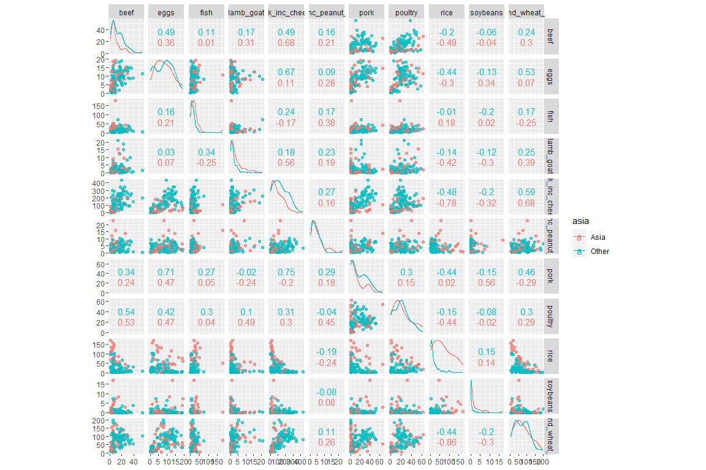
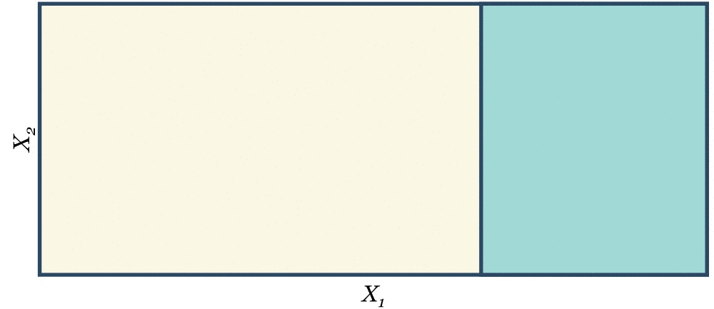

esercitazione 1
================
[Niccolò Salvini](https://niccolosalvini.netlify.app/)
2020-05-03

## gentile introduzione

Ho estratto questa esercitazione da un video tutorial su Youtube di
[Julia Silge](https://www.youtube.com/watch?v=muf3-hrahHs), E’ una
Software Engineer di RStudio con esperienza come DS in StackOverflow e
co. Ha un PhD in Astrofisica e tiene un [blog](https://juliasilge.com/)
dove tratta estensivamente ma non esclusivamente la preparazione, la
modellazione e il risultato dei modelli con `tidymodels`. I suoi
tutorial sono scheletrici e frontali ma centrano il punto.
L’esercitazione si centra attorno a un satellite del mondo
`tidymodels`, cioè `parnsip`, in particolare la parte di tuning dei
parametri in una ricerca a griglia. Questa esercitazione mi è servita a
consolidare alcune nozioni sugli iper parametri di punta nella
modellazione con random forest, mi è servita per avere una pipeline
riproducibile e veloce che valuta e poi predice un fattore binario,
infine a dare un workflow pronti-via di analisi per il tipo di dato
utilizzato. La saga continua affrontando con diversi dataset, diversi
segmenti del tidy-worflow di modellazione, sempre esplorando attraverso
il mondo `tidymodels`. In questo breve tutorial `parsnip` è lo strumento
centrale, anche se per arrivare lì è necessario passare prima dal
‘villaggio’ di `rsamples`, successivamente dalla città di `recipes.`
Alla fine del viaggio si può ammirare da lontano sulla destra
`yardstick`

## il dataset

``` r
food_consumption = readr::read_csv("https://raw.githubusercontent.com/rfordatascience/tidytuesday/master/data/2020/2020-02-18/food_consumption.csv")

food_consumption
#> # A tibble: 1,430 x 4
#>    country   food_category            consumption co2_emmission
#>    <chr>     <chr>                          <dbl>         <dbl>
#>  1 Argentina Pork                           10.5          37.2 
#>  2 Argentina Poultry                        38.7          41.5 
#>  3 Argentina Beef                           55.5        1712   
#>  4 Argentina Lamb & Goat                     1.56         54.6 
#>  5 Argentina Fish                            4.36          6.96
#>  6 Argentina Eggs                           11.4          10.5 
#>  7 Argentina Milk - inc. cheese            195.          278.  
#>  8 Argentina Wheat and Wheat Products      103.           19.7 
#>  9 Argentina Rice                            8.77         11.2 
#> 10 Argentina Soybeans                        0             0   
#> # ... with 1,420 more rows
```

il dataset è estratto da un csv e mostra il consumo di diversi alimenti
per diverse nazioni. Le colonne sono 4:

1.  *country* : il paese dove ha luogo il consumo
2.  *food\_category* : la categoria del cibo consumato
3.  *consumption* : il consumo in unità di misura (non so quale)
4.  *co2\_emission*: le emissioni di co2

obiettivo: fai un predizione sulla base del consumo dei diversi
predittori se se il paese si trova in asia o no

Non andremo a vedere, come anticipato nell’introduzione un workflow
intero, ma un segmento dello stesso, con un focus sul tuning dei
parametri. Prima di fare tutto questo è necessario riformattare il
dataset di modo che contega solo variabili di interesse. La prima
trasformazione viene fatta codificando la colonna *country* e
introducendone una successiva che contiene i continenti di quegli stessi
paesi, per fare questo viene usato un pacchetto che si chiama. Questo
pacchetto mappa ogni paese in un singolo continente (many-to-one). La
funzione mutate() introduce la nuova colonna *continents*.
`countrycode()` prende come input la colonna del dataframe che desidero
trasformare, un’origine, cioè il tipo di trasformazione che desidero
dare alla mia, lo voglio in lingua inglese ed in caratteri, avrei potuto
scegliere in ZIP code (CAP) e destination è la colonna di destinazione
della discretizzazione che abbiamo fatto. Controllo che la
*discretizzazione* non abbia creato NAs guardando il conto delle righe
del dataset master contro quello appena generato. Decido anche che c02
non è di mio interesse quindi con l’operatore `select()` la deselezione
(meno davanti). Adesso decido di fare una tabella pivot con
`pivot_wider()` cosicchè i fattori della colonna *food\_category*
diventino predittori e decido di accomodarli secondo l’ordine del
*consumption*, che infatti sparisce dalla nuova tabella pivot. Janitor
aiuta a togliere le quotes alle colonne dei nomi. Quindi decido di
creare una nuovo predittore *asia* schiacciando la colonna *continents*
di risposta in due livelli, asia e others, cosicchè sia una
classificazione binaria. Successivamente mi sbarazzo di continente e di
paese e infine cambio in fattore le colonne che ho introdotto che sono
state codificate come carattere (ovvero *asia*).

``` r

library(countrycode)
library(janitor)
#> 
#> Attaching package: 'janitor'
#> The following objects are masked from 'package:stats':
#> 
#>     chisq.test, fisher.test
library(tidyr)

food = food_consumption %>%
  select(-co2_emmission) %>%
  pivot_wider(
    names_from = food_category,
    values_from = consumption
  ) %>%
  clean_names() %>%
  mutate(continent = countrycode(
    country,
    origin = "country.name",
    destination = "continent"
  )) %>%
  mutate(asia = case_when(
    continent == "Asia" ~ "Asia",
    TRUE ~ "Other"
  )) %>%
  select(-country, -continent) %>%
  mutate_if(is.character, factor)

food
#> # A tibble: 130 x 12
#>     pork poultry  beef lamb_goat  fish  eggs milk_inc_cheese wheat_and_wheat~
#>    <dbl>   <dbl> <dbl>     <dbl> <dbl> <dbl>           <dbl>            <dbl>
#>  1  10.5    38.7  55.5      1.56  4.36 11.4             195.            103. 
#>  2  24.1    46.1  33.9      9.87 17.7   8.51            234.             70.5
#>  3  10.9    13.2  22.5     15.3   3.85 12.5             304.            139. 
#>  4  21.7    26.9  13.4     21.1  74.4   8.24            226.             72.9
#>  5  22.3    35.0  22.5     18.9  20.4   9.91            137.             76.9
#>  6  27.6    50.0  36.2      0.43 12.4  14.6             255.             80.4
#>  7  16.8    27.4  29.1      8.23  6.53 13.1             211.            109. 
#>  8  43.6    21.4  29.9      1.67 23.1  14.6             255.            103. 
#>  9  12.6    45    39.2      0.62 10.0   8.98            149.             53  
#> 10  10.4    18.4  23.4      9.56  5.21  8.29            288.             92.3
#> # ... with 120 more rows, and 4 more variables: rice <dbl>, soybeans <dbl>,
#> #   nuts_inc_peanut_butter <dbl>, asia <fct>
```

introduco un nuovo pacchetto che si chiama `GGally` che permettere di
avere una veloce prospettiva del dataset disegnando una matrice di
scatterplot dove le colonne e le righe sono i predittori e la diagonale
principale rappresenta le pdf dei rispettivi predittori per i due
livelli della variabile di risposta. In particolare se immaginiamo che
la diagonale principale possa dividere la matrice quadrata in due
triangoli distinti allora il triangolo *superiore* rappresenta la
correlazioen tra le variabili di incrocio, mentre quello *inferiore*
rappresenta lo scatterplot delle variabili di incontro. La funzione
generatrice prende come input il dataset, le colonne per la matrice e la
facettizzazione dei colori per la variabile di risposta (qui ci va
sempre la variabile di risposta). Infine la variabile alpha è l’indice
di trasparenza dei colori nella facettizazione, va settato
ragionevolmente basso.

``` r
library(GGally)
#> Registered S3 method overwritten by 'GGally':
#>   method from   
#>   +.gg   ggplot2
#> 
#> Attaching package: 'GGally'
#> The following object is masked from 'package:dplyr':
#> 
#>     nasa
ggscatmat(food, columns = 1:11, color = "asia", alpha = 0.7)
```

<!-- -->

cosa si può notare: 1. *beef* and *poultry* sono molto **correlati** per
il livello others della variabile di risposta, mentre non lo è per
l’asia. Questo significa che nei paese fuori dall’asia ad una crescita
del consumo di pollame corrisponde una crescita più o meno lineare del
consumo di carne di manzo. In asia, invece, un aumento del consumo di
pollame non si lega con un aumento di consumo di manzo, riconducibile al
fatto che in india non si mangia manzo. 1. una differenza nell
distribuzione per diversi livelli di *rice* (sto guardando l’ incontro
tra rice e rice nella diagonale identità) 1. stessa cosa si verifica tra
*eggs* and *milk*. Posso cominciare a pensare che il consumo di latte
sia schiacciato verso lo zero dal peso indiano.

Tutto questo mi porta a pensare che un modello a base di alberi di
classificazione può essere un buon punto di partenza, perchè questi
modelli facilmente distinguono quelle differenze sottolineate prima.
(gif sotto del perchè).



## tuning

come tecina di resampling visto che ho una dimensionalità scarsa penso
che si possa utilizzare un approccio *bootstrap* resamples. *Boostrap*
consiste in un pescaggio ripetuto da un campione con la possibilità di
ripetizione. Ho deciso 30 resamples, 25 sono i quelli standard. Ancora
una volta non tutto questo è programmato nel senso di messo nella
ricetta, ma ancora nessuno ha cominciato a cuocere, in sostanza nessun
calcolo è stato fatto. Stampando la procedura di resampling si può
vedere la scomposizione tra analysis e assessement set (che nel gergo
tidy sono train e test set).

``` r
  set.seed(1234)
food_boot = bootstraps(food, times = 30)
food_boot
#> # Bootstrap sampling 
#> # A tibble: 30 x 2
#>    splits           id         
#>    <list>           <chr>      
#>  1 <split [130/48]> Bootstrap01
#>  2 <split [130/49]> Bootstrap02
#>  3 <split [130/49]> Bootstrap03
#>  4 <split [130/51]> Bootstrap04
#>  5 <split [130/47]> Bootstrap05
#>  6 <split [130/51]> Bootstrap06
#>  7 <split [130/57]> Bootstrap07
#>  8 <split [130/51]> Bootstrap08
#>  9 <split [130/44]> Bootstrap09
#> 10 <split [130/53]> Bootstrap10
#> # ... with 20 more rows
```

## assetto del modello

prima inizializzo l’oggetto s3 modello random forest che nel gergo tidy
è `rand_forest()`, succssivamente specifico il modo, cioè lo scopo per
cui faccio il modello, la classificazione e gli iperparametri. ci sono
pochi iperparametri in `rand_forest()` che necessitano il tuning, uno di
questi (quello che conta forse di più) è di sicuro *mtry*, per
completezza gli altri 3:

1.  *mtry* : quanti predittori saranno randomicamenente pescati in ogni
    divisione dell’albero.
2.  *tree* : di solito non vengono tunati, è necessario metterne un
    numero sufficiente.
3.  *min\_n*: il numero minimo di punti in un nodo che sono necessari
    per dividere nuovamente l’albero.

quindi la scelta ricade o sulle best practises o una fase di tuning
degli iperparametri per trovare l’insieme migliore degli stessi per
descrivere il fenomeno. La scelta ricade sul tuning.

1.  *mtry* : tune
2.  *tree* : 1000
3.  *min\_n*: tune

nell’oggetto devo specificare il motore col quale `rand_forest()` si
deve muovere, “`ranger`” è il più comune. Ancora, per il momento, non è
stato attuato nessun calcolo. In questo caso si è scelto ti utilizzare
una griglia continua di valori, cioè tutti i valori, tutte le
combinazioni per vedere quale è la combinazione migliore. Nella griglia
specifico il modello, cioè variabile di risposta e e predittori, tutti,
il modello con dentro i parametri da ottimizzare e l’insieme di
resampling.

``` r
rf_spec = rand_forest(
  mode = "classification",
  mtry = tune(),
  trees = 1000,
  min_n = tune()
) %>%
  set_engine("ranger")

rf_spec
#> Random Forest Model Specification (classification)
#> 
#> Main Arguments:
#>   mtry = tune()
#>   trees = 1000
#>   min_n = tune()
#> 
#> Computational engine: ranger
```

## metriche e valutazione

Eseguo le operazioni in parallelo perchè la griglia è abbastanza lunga e
computazionalmente dispendiosa. Occorerebbe circa 1 minuto per far
girare tutti i calcoli in tempo \[O(n^2)\], in parallelo riduco a
lineare \[O(n)\].

``` r
doParallel::registerDoParallel()

rf_grid = tune_grid(
  asia ~ .,
  model = rf_spec,
  resamples = food_boot
)
#> Warning: `tune_grid.formula()` is deprecated as of lifecycle 0.1.0.
#> The first argument to `tune_grid()` should be either a model or a workflow. In the future, you can use:
#> tune_grid(rf_spec, asia ~ ., resamples = food_boot)
#> This warning is displayed once every 8 hours.
#> Call `lifecycle::last_warnings()` to see where this warning was generated.
#> i Creating pre-processing data to finalize unknown parameter: mtry

rf_grid
#> # Bootstrap sampling 
#> # A tibble: 30 x 4
#>    splits           id          .metrics          .notes          
#>    <list>           <chr>       <list>            <list>          
#>  1 <split [130/48]> Bootstrap01 <tibble [20 x 5]> <tibble [0 x 1]>
#>  2 <split [130/49]> Bootstrap02 <tibble [20 x 5]> <tibble [0 x 1]>
#>  3 <split [130/49]> Bootstrap03 <tibble [20 x 5]> <tibble [0 x 1]>
#>  4 <split [130/51]> Bootstrap04 <tibble [20 x 5]> <tibble [0 x 1]>
#>  5 <split [130/47]> Bootstrap05 <tibble [20 x 5]> <tibble [0 x 1]>
#>  6 <split [130/51]> Bootstrap06 <tibble [20 x 5]> <tibble [0 x 1]>
#>  7 <split [130/57]> Bootstrap07 <tibble [20 x 5]> <tibble [0 x 1]>
#>  8 <split [130/51]> Bootstrap08 <tibble [20 x 5]> <tibble [0 x 1]>
#>  9 <split [130/44]> Bootstrap09 <tibble [20 x 5]> <tibble [0 x 1]>
#> 10 <split [130/53]> Bootstrap10 <tibble [20 x 5]> <tibble [0 x 1]>
#> # ... with 20 more rows
```

sotto colleziono le metriche per il modello che ho chiuso, le metriche
non essendo state specificate e non essendo stata costruita nessuna
metrica personalizzate utilizza un insieme di precisione e ROC AUC.

``` r
rf_grid %>%
  collect_metrics()
#> # A tibble: 20 x 7
#>     mtry min_n .metric  .estimator  mean     n std_err
#>    <int> <int> <chr>    <chr>      <dbl> <int>   <dbl>
#>  1     2     4 accuracy binary     0.838    30 0.00753
#>  2     2     4 roc_auc  binary     0.843    30 0.00917
#>  3     2    12 accuracy binary     0.829    30 0.00786
#>  4     2    12 roc_auc  binary     0.837    30 0.00947
#>  5     4    33 accuracy binary     0.814    30 0.00830
#>  6     4    33 roc_auc  binary     0.819    30 0.0107 
#>  7     4    37 accuracy binary     0.816    30 0.00849
#>  8     4    37 roc_auc  binary     0.818    30 0.0104 
#>  9     5    31 accuracy binary     0.817    30 0.00845
#> 10     5    31 roc_auc  binary     0.821    30 0.0107 
#> 11     6     9 accuracy binary     0.824    30 0.00900
#> 12     6     9 roc_auc  binary     0.834    30 0.00928
#> 13     7    21 accuracy binary     0.816    30 0.00940
#> 14     7    21 roc_auc  binary     0.826    30 0.0102 
#> 15     8    18 accuracy binary     0.819    30 0.00892
#> 16     8    18 roc_auc  binary     0.824    30 0.0101 
#> 17     9    26 accuracy binary     0.815    30 0.0100 
#> 18     9    26 roc_auc  binary     0.822    30 0.0106 
#> 19    11    15 accuracy binary     0.811    30 0.0110 
#> 20    11    15 roc_auc  binary     0.822    30 0.0108
```

## sitografia

  - [Julia Silge](https://juliasilge.com/blog/food-hyperparameter-tune/)
    blog.
  - [Tidymodels](https://rviews.rstudio.com/2019/06/19/a-gentle-intro-to-tidymodels/)
    env
  - [YT video](https://www.youtube.com/watch?v=muf3-hrahHs)
